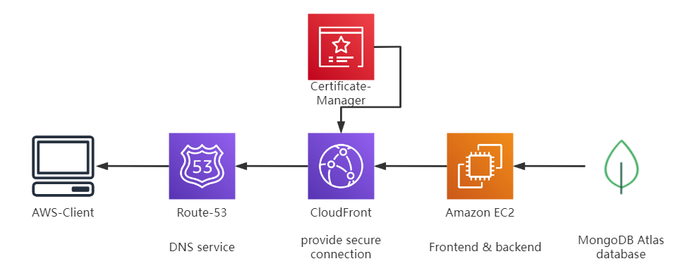
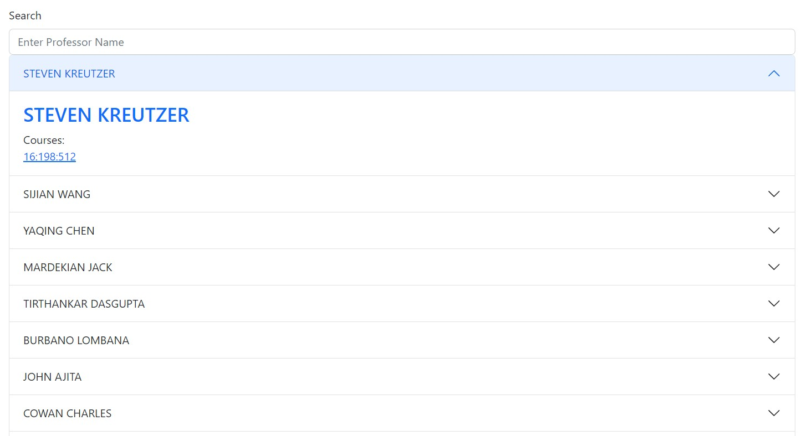
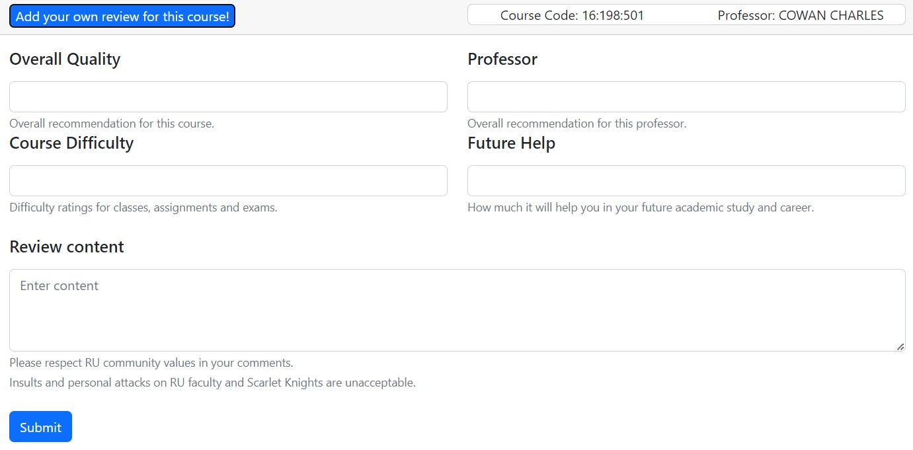
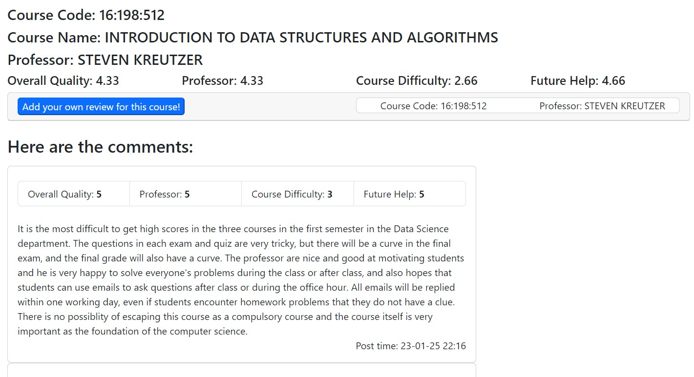
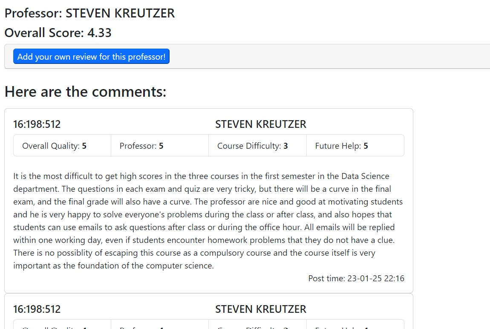

# RU Rating

<a href="https://www.rurating.com">
<svg xmlns="http://www.w3.org/2000/svg" xmlns:xlink="http://www.w3.org/1999/xlink" width="134" height="20" role="img" aria-label="Website: rurating.com"><title>Website: rurating.com</title><linearGradient id="s" x2="0" y2="100%"><stop offset="0" stop-color="#bbb" stop-opacity=".1"/><stop offset="1" stop-opacity=".1"/></linearGradient><clipPath id="r"><rect width="134" height="20" rx="3" fill="#fff"/></clipPath><g clip-path="url(#r)"><rect width="53" height="20" fill="#555"/><rect x="53" width="81" height="20" fill="#e05d44"/><rect width="134" height="20" fill="url(#s)"/></g><g fill="#fff" text-anchor="middle" font-family="Verdana,Geneva,DejaVu Sans,sans-serif" text-rendering="geometricPrecision" font-size="110"><text aria-hidden="true" x="275" y="150" fill="#010101" fill-opacity=".3" transform="scale(.1)" textLength="430">Website</text><text x="275" y="140" transform="scale(.1)" fill="#fff" textLength="430">Website</text><text aria-hidden="true" x="925" y="150" fill="#010101" fill-opacity=".3" transform="scale(.1)" textLength="710">rurating.com</text><text x="925" y="140" transform="scale(.1)" fill="#fff" textLength="710">rurating.com</text></g></svg></a>

<a href="mailto:rucsrate@gmail.com">
<svg xmlns="http://www.w3.org/2000/svg" xmlns:xlink="http://www.w3.org/1999/xlink" width="96" height="20" role="img" aria-label="Email: rucsrate"><title>Email: rucsrate</title><linearGradient id="s" x2="0" y2="100%"><stop offset="0" stop-color="#bbb" stop-opacity=".1"/><stop offset="1" stop-opacity=".1"/></linearGradient><clipPath id="r"><rect width="96" height="20" rx="3" fill="#fff"/></clipPath><g clip-path="url(#r)"><rect width="41" height="20" fill="#555"/><rect x="41" width="55" height="20" fill="#007ec6"/><rect width="96" height="20" fill="url(#s)"/></g><g fill="#fff" text-anchor="middle" font-family="Verdana,Geneva,DejaVu Sans,sans-serif" text-rendering="geometricPrecision" font-size="110"><text aria-hidden="true" x="215" y="150" fill="#010101" fill-opacity=".3" transform="scale(.1)" textLength="310">Email</text><text x="215" y="140" transform="scale(.1)" fill="#fff" textLength="310">Email</text><text aria-hidden="true" x="675" y="150" fill="#010101" fill-opacity=".3" transform="scale(.1)" textLength="450">rucsrate</text><text x="675" y="140" transform="scale(.1)" fill="#fff" textLength="450">rucsrate</text></g></svg></a>
    

RU Rating is designed to help students in RU share their feedback with specific courses and professors. You can use Departments Menu to check which department's courses is available in RU Rating. The courselist can help you search for the course you are interested in, and every course is combined with one professor. You can use Professor Menu to see all the reviews about the professor. Right now, the best experience is to use it on a computer with normal screen scaling.

Feel free to contact us by emailing <a href = "mailto:rucsrate@gmail.com">rucsrate@gmail.com</a>. Your feedback can help us correct the information and make this website help more Scarlet Knights!

Here is the structure of our website:

## Data Source
The information and course outline of the courses are initially extracted from publicly available sources within various departments using the JAVA [Jsoup](https://github.com/jhy/jsoup) library. We currently collect course synopses from CS, ECE and DS Department:
- [Course Synopses of Computer Science Department](https://www.cs.rutgers.edu/academics/graduate/m-s-program/course-synopses)
- [Course Descriptions of Electrical & Computer Engineering](https://www.ece.rutgers.edu/graduate-course-descriptions)
- [Course Descriptions of Data Science Program](https://msds-stat.rutgers.edu/msds-academics/msds-coursedesc)

Subsequently, access as Rutgers student NetID to gather more detailed information, including specific course arrangements and instructor information for each course, by scraping data from the [Web Registration System of Rutgers](https://sims.rutgers.edu/webreg).

## Frontend
- Annoucement update

On the [Dashboard](https://www.rurating.com/) page, we continuously update the annoucement the development team releases. Some of these annoucement guide users on how to use RU Rating more effectively, and others provide information on any issues and their resolution and, at times, facilitate communication between users and the development team.
- Course overview

The origin of the courses stored in the database, you can check the avaiable courses and access them on [Department](https://www.rurating.com/department) page. On [Courselist](https://www.rurating.com/courselist) page, the stored course information is organized and presented in a tabular format for ease of understanding and navigation:

- Professor overview

On [Professor](https://www.rurating.com/professor) page, we provide a comprehensive table of all instructors who have teaching assignments, offering a link to their personal profiles and the courses they are responsible for teaching."

- Submit review

We use [React-Bootstrap](https://github.com/react-bootstrap/react-bootstrap) to build review form, users can choose score in specific field and submit their own comments. The score is designed from 0 to 5 and we make sure score of review can not be empty and users can not repeatly submit for one particular course.

- Detail page

Each comment is treated as a separate component and is invoked and displayed on the course and professor detail pages.

-----

## Backend
The backend use spring boot framework and following is the architecture:

Key Features:
- provide easy-to use and fully documented API 
- Course & Professor Review and Ratings
- Search feature and filters for Course & Professor
- Average Score calculation
- Basic IP tracking to prevent adding multiple malicious content in short period
- Announcement display

### Database
Ru Rating uses MongoDB Atlas as the database. There are 4 main collections in the database: 
- Announcement,
  - Contains announcement title and content 
- Courses
  - Contains department, course code, course name, professor, score, year, season and topics.
  - professor is a reference to the Professor collection
  - Since each course in different semester may have different professor and different quality, so course with the same code in different semester are treated as different course.
- Professor
  - Contains name, email, score and department
- Review
  - Contains courseId, score, content and time
  - CourseId is a reference to the Course collection, since courses in each semester are recognized as different courses, the professor information can also getten from the Course collection
  - Score is a consists of professor , preference, difficulty and helpfulness score

#### TradeOff in scores
Since the average score are widely used in the frontend, instead of storing the score in the review and calculate each time, by taking the advantage of NoSQL, we do not strictly follow the 3NF and store the calculated score in Professor and Courses, and update them on any review score changes.

### Security
Since registering an account will make commenting more troublesome, anonymization can also ensure that comments are more objective. We are prohibiting IP addresses that repeatedly comment on courses to prevent malicious comments and ensure the validity of comments.

## Contribution

- [santyelegy](https://github.com/santyelegy)
Front-end + Back-end, DevOps.
- [Cesartwothousands](https://github.com/Cesartwothousands)
Front-end, scraping engineer.
Connect on [Linkedln](https://www.linkedin.com/in/zihanchenyc/).
- [XUQIPAN](https://github.com/XUQIPAN)
Back-end engineer.

<a href="https://github.com/santyelegy/RUCSRate/graphs/contributors"> All Contributors</a>